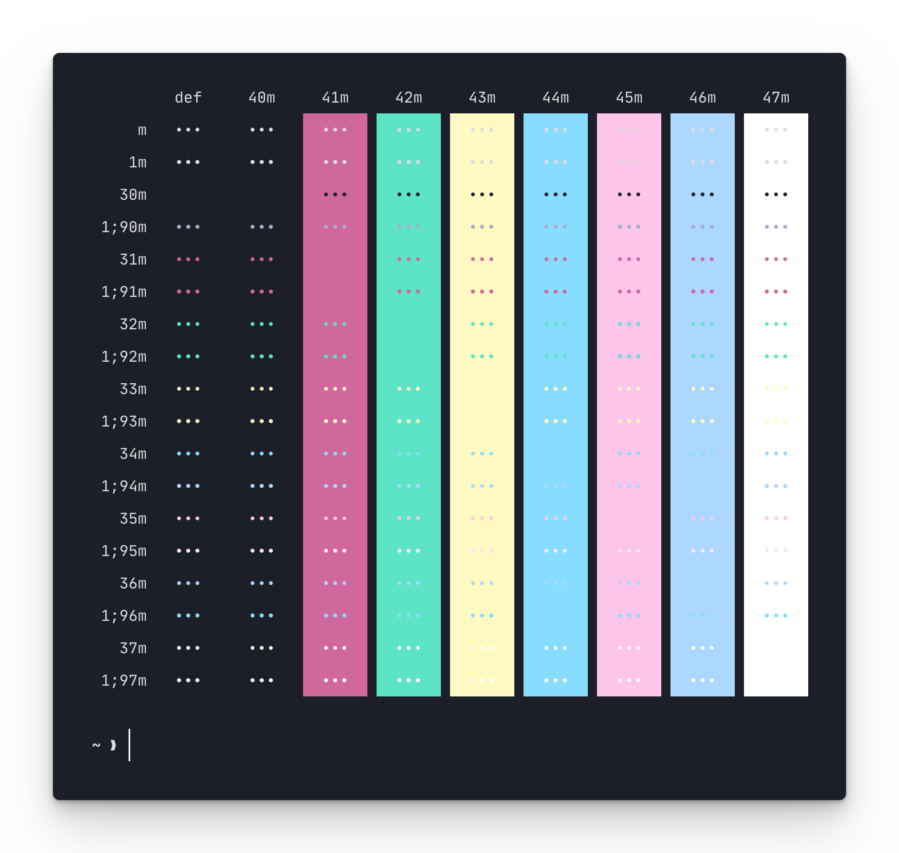

<p align="middle">
  
  
</p>

Unofficial [Poimandres](https://github.com/drcmda/poimandres-theme) theme for [Kitty](https://github.com/kovidgoyal/kitty)

The screencap above uses the following settings:

```conf
font_family JetBrainsMono Nerd Font
font_size 14
adjust_line_height 175%
window_padding_width 10
hide_window_decorations yes
```

## Related

- [poimandres-theme][poimandres-theme]: Original VSCode theme
- [poimandres-alacritty][poimandres-alacritty]: Alacritty version
- [poimandres-iterm][poimandres-iterm]: Iterm version
- [poimandres-wezterm][poimandres-wezterm]: Wezterm version
- [poimandres.nvim][poimandres.nvim]: Neovim version written in Lua

[poimandres-theme]: https://github.com/drcmda/poimandres-theme
[poimandres-alacritty]: https://github.com/z0al/poimandres-alacritty
[poimandres-iterm]: https://github.com/alii/poimandres-iterm
[poimandres-wezterm]: https://github.com/olivercederborg/poimandres-wezterm
[poimandres.nvim]: https://github.com/olivercederborg/poimandres.nvim

### Hyper theme

```bash
hyper i hyper-pmndrs
```
